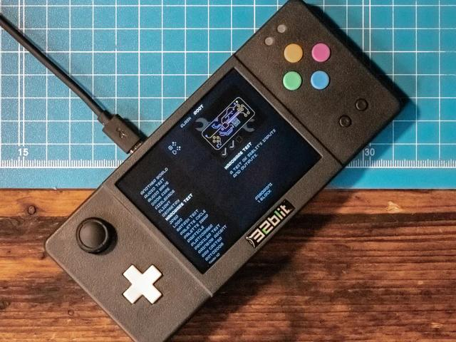
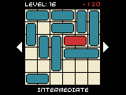

<section class="intro">
    <article>
        <h3>What is 32blit?</h3>
        
32blit is a set of tools and software to help you build games for embedded devices.

        
It was originally developed for its namesake- the STM32-based 32blit console - and has since been ported to the Raspberry Pi Pico, including the <a href="https://shop.pimoroni.com/products/picosystem">Pimoroni PicoSystem</a>.

    </article>
    <article>
        <h3>32blit SDK</h3>
        <ul>
            <li><a href="https://github.com/32blit/32blit-sdk/releases/latest">Latest SDK Release</a></li>
            <li><a href="https://github.com/32blit/32blit-sdk/">Source @ GitHUb</a></li>
        </ul>
    </article>
</section>
<section class="links">
    <article>
        <h3>Documentation</h3>
        <ul>
            <li><a href="https://github.com/32blit/32blit-sdk/tree/master/docs#32blit-sdk">SDK Documentation</a></li>
        </ul>
    </article>
    <article>
        <h3>Games</h3>
        <ul>
            <li><a href="https://blithub.co.uk/">Blithub (for 32blit hardware)</a></li>
            <li><a href="https://cupboard.daftgames.net/32blit/?view=grid&sort=title&device=picosystem">DaftGames auto-builds (PicoSystem)</a></li>
            <li><a href="https://cupboard.daftgames.net/32blit/?view=grid&sort=title&device=32blit">DaftGames auto-builds (32blit)</a></li>
            <li><a href="https://32blit.github.io/32blit-sdk/examples/">Playable examples (web)</a></li>
        </ul>
    </article>
    <article>
        <h3>Community</h3>
        
Join the 32blit community on Discord- <a href="https://discord.gg/JuHAvACrDG">https://discord.gg/JuHAvACrDG</a>

    </article>
</section>
<h2>Tutorials</h2>
<section class="tutorials">
    <article>
        <h3>Getting Started</h3>
        <ul>
            <li><a href="/community-tutorials/tutorials/contents.html">Community Tutorials</a></li>
        </ul>
    </article>
    <article>
        <h3>Writing Code</h3>
        <ul>
            <li>Haptic Feedback</li>
            <li>Menus</li>
            <li>Vectors</li>
        </ul>
    </article>
    <article>
        <h3>Sharing Your Game</h3>
        <ul>
            <li>Build for all platforms</li>
            <li>Share on Blithub</li>
            <li>Sell on Itch.io</li>
        </ul>
    </article>
</section>
<h2>Hardware</h2>
<section class="hardware">
    <article>
        <h3>32blit (EOL)</h3>
        
        
The 32blit SDK's STM32-based namesake and original target.

        
<a href="https://shop.pimoroni.com/products/32blit-dev-kit">More information.</a>

    </article>
    <article>
        <h3>PicoSystem</h3>
        
        
The RP2040-based mini-handheld from Pimoroni.

        
<a href="https://shop.pimoroni.com/products/picosystem?variant=32369546985555">Buy PicoSystem from Pimoroni</a>

    </article>
    <article>
        <h3>???</h3>
        
Got an embedded gaming handheld you think could run 32blit SDK? Let us know at GitHub.

        
<a href="https://github.com/32blit/32blit-sdk/">32blit SDK @ GitHub</a>

    </article>
</section>
<h2>Featured Games</h2>
<section class="games">
    <article>
        <h3>Blockgame</h3>
        
        
A game about blocks.

        
<a href="https://blithub.co.uk/blits/ali1234/blockgame">Download Blockgame from blithub</a>

    </article>
    <article>
        <h3>Gate Keeper</h3>
        
        
A short and sweet 30 minute RPG.

        
<a href="https://blithub.co.uk/blits/Blackhawk-TA/gate-keeper">Download Gate Keeper from blithub</a>

    </article>
    <article>
        <h3>Free-Red</h3>
        
        
Free the red block by sliding the others out of its way.

        
<a href="https://blithub.co.uk/blits/lummi01/free-red">Download Free-Red from blithub</a>

    </article>
</section>
